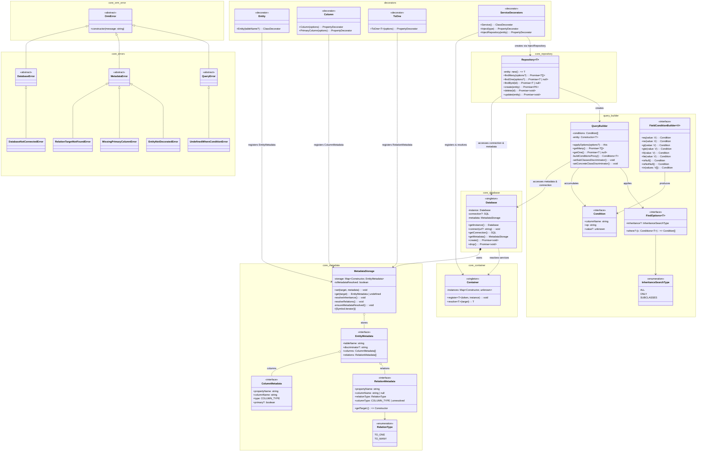

# Class Diagram

```mermaid
classDiagram
    %% ── core/orm-error ───────────────────────────────────────────────────────
    namespace core_orm_error {
        class OrmError {
            <<abstract>>
            +constructor(message: string)
        }
    }

    %% ── core/errors ──────────────────────────────────────────────────────────
    namespace core_errors {
        class DatabaseError {
            <<abstract>>
        }
        class MetadataError {
            <<abstract>>
        }
        class QueryError {
            <<abstract>>
        }
        class DatabaseNotConnectedError
        class RelationTargetNotFoundError
        class MissingPrimaryColumnError
        class EntityNotDecoratedError
        class UndefinedWhereConditionError
    }

    OrmError <|-- DatabaseError
    OrmError <|-- MetadataError
    OrmError <|-- QueryError
    DatabaseError <|-- DatabaseNotConnectedError
    MetadataError <|-- RelationTargetNotFoundError
    MetadataError <|-- MissingPrimaryColumnError
    MetadataError <|-- EntityNotDecoratedError
    QueryError <|-- UndefinedWhereConditionError

    %% ── core/metadata ────────────────────────────────────────────────────────
    namespace core_metadata {
        class MetadataStorage {
            -storage: Map~Constructor, EntityMetadata~
            -isMetadataResolved: boolean
            +set(target, metadata): void
            +get(target): EntityMetadata | undefined
            -resolveInheritance(): void
            -resolveRelations(): void
            -ensureMetadataResolved(): void
            +[Symbol.iterator]()
        }
        class EntityMetadata {
            <<interface>>
            +tableName: string
            +discriminator?: string
            +columns: ColumnMetadata[]
            +relations: RelationMetadata[]
        }
        class ColumnMetadata {
            <<interface>>
            +propertyName: string
            +columnName: string
            +type: COLUMN_TYPE
            +primary?: boolean
        }
        class RelationMetadata {
            <<interface>>
            +propertyName: string
            +columnName: string | null
            +relationType: RelationType
            +columnType: COLUMN_TYPE | unresolved
            +getTarget: () => Constructor
        }
        class RelationType {
            <<enumeration>>
            TO_ONE
            TO_MANY
        }
    }

    MetadataStorage o-- EntityMetadata : stores
    EntityMetadata o-- ColumnMetadata : columns
    EntityMetadata o-- RelationMetadata : relations
    RelationMetadata --> RelationType

    %% ── core/database ────────────────────────────────────────────────────────
    namespace core_database {
        class Database {
            <<singleton>>
            -instance: Database
            -connection?: SQL
            -metadata: MetadataStorage
            +getInstance(): Database
            +connect(url?: string): void
            +getConnection(): SQL
            +getMetadata(): MetadataStorage
            +create(): Promise~void~
            +drop(): Promise~void~
        }
    }

    Database *-- MetadataStorage : owns

    %% ── core/container ───────────────────────────────────────────────────────
    namespace core_container {
        class Container {
            <<singleton>>
            -instances: Map~Constructor, unknown~
            +register~T~(token, instance): void
            +resolve~T~(target): T
        }
    }

    Database --> Container : resolves services

    %% ── core/repository ──────────────────────────────────────────────────────
    namespace core_repository {
        class Repository~T~ {
            -entity: new() => T
            +findMany(options?): Promise~T[]~
            +findOne(options?): Promise~T | null~
            +findById(id): Promise~T | null~
            +create(entity): Promise~PK~
            +delete(id): Promise~void~
            +update(entity): Promise~void~
        }
    }

    Repository --> Database : accesses connection & metadata
    Repository --> QueryBuilder : creates

    %% ── query-builder ────────────────────────────────────────────────────────
    namespace query_builder {
        class QueryBuilder~T~ {
            -conditions: Condition[]
            -entity: Constructor~T~
            +applyOptions(options?): this
            +getMany(): Promise~T[]~
            +getOne(): Promise~T | null~
            -buildConditionsProxy(): Conditions~T~
            -setSubClassesDiscriminator(): void
            -setConcreteClassDiscriminator(): void
        }
        class Condition {
            <<interface>>
            +columnName: string
            +op: string
            +value?: unknown
        }
        class FieldConditionBuilder~V~ {
            <<interface>>
            +eq(value: V): Condition
            +ne(value: V): Condition
            +gt(value: V): Condition
            +gte(value: V): Condition
            +lt(value: V): Condition
            +lte(value: V): Condition
            +isNull(): Condition
            +isNotNull(): Condition
            +in(values: V[]): Condition
        }
        class FindOptions~T~ {
            <<interface>>
            +where?: (c: Conditions~T~) => Condition[]
            +inheritance?: InheritanceSearchType
        }
        class InheritanceSearchType {
            <<enumeration>>
            ALL
            ONLY
            SUBCLASSES
        }
    }

    QueryBuilder --> Database : accesses metadata & connection
    QueryBuilder --> Condition : accumulates
    QueryBuilder --> FindOptions : applies
    FieldConditionBuilder --> Condition : produces
    FindOptions --> InheritanceSearchType

    %% ── decorators ───────────────────────────────────────────────────────────
    namespace decorators {
        class Entity {
            <<decorator>>
            +Entity(tableName?): ClassDecorator
        }
        class Column {
            <<decorator>>
            +Column(options): PropertyDecorator
            +PrimaryColumn(options): PropertyDecorator
        }
        class ToOne {
            <<decorator>>
            +ToOne~T~(options): PropertyDecorator
        }
        class ServiceDecorators {
            <<decorator>>
            +Service(): ClassDecorator
            +Inject(type): PropertyDecorator
            +InjectRepository(entity): PropertyDecorator
        }
    }

    Entity --> MetadataStorage : registers EntityMetadata
    Column --> MetadataStorage : registers ColumnMetadata
    ToOne --> MetadataStorage : registers RelationMetadata
    ServiceDecorators --> Container : registers & resolves
    ServiceDecorators --> Repository : creates via InjectRepository
```
