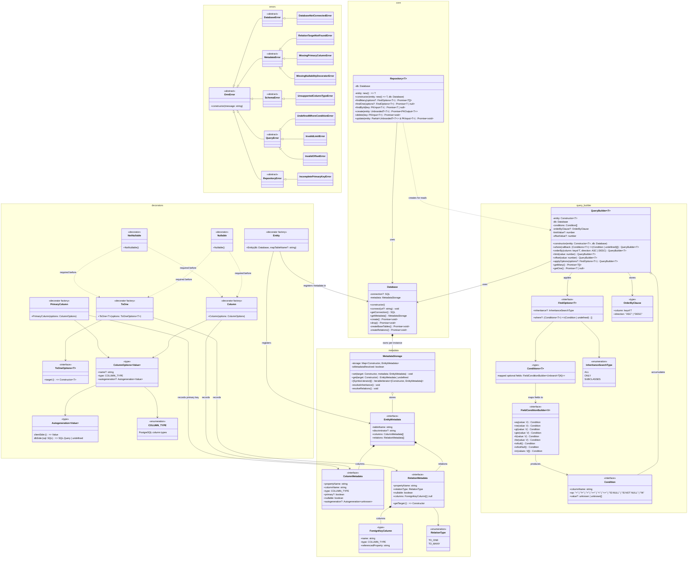

# Diagrama de classes

```mermaid
classDiagram
    direction TB

    %% ── errors ──────────────────────────────────────────────────────────────
    namespace errors {
        class OrmError {
            <<abstract>>
            +constructor(message: string)
        }
        class DatabaseError { <<abstract>> }
        class DatabaseNotConnectedError
        class MetadataError { <<abstract>> }
        class RelationTargetNotFoundError
        class MissingPrimaryColumnError
        class MissingNullabilityDecoratorError
        class SchemaError { <<abstract>> }
        class UnsupportedColumnTypeError
        class QueryError { <<abstract>> }
        class UndefinedWhereConditionError
        class InvalidLimitError
        class InvalidOffsetError
        class RepositoryError { <<abstract>> }
        class IncompletePrimaryKeyError
    }

    OrmError <|-- DatabaseError
    DatabaseError <|-- DatabaseNotConnectedError
    OrmError <|-- MetadataError
    MetadataError <|-- RelationTargetNotFoundError
    MetadataError <|-- MissingPrimaryColumnError
    MetadataError <|-- MissingNullabilityDecoratorError
    OrmError <|-- SchemaError
    SchemaError <|-- UnsupportedColumnTypeError
    OrmError <|-- QueryError
    QueryError <|-- UndefinedWhereConditionError
    QueryError <|-- InvalidLimitError
    QueryError <|-- InvalidOffsetError
    OrmError <|-- RepositoryError
    RepositoryError <|-- IncompletePrimaryKeyError

    %% ── metadata ────────────────────────────────────────────────────────────
    namespace metadata {
        class MetadataStorage {
            -storage: Map~Constructor, EntityMetadata~
            -isMetadataResolved: boolean
            +set(target: Constructor, metadata: EntityMetadata) void
            +get(target: Constructor) EntityMetadata | undefined
            +[Symbol.iterator]() IterableIterator~[Constructor, EntityMetadata]~
            -resolveInheritance() void
            -resolveRelations() void
        }
        class EntityMetadata {
            <<interface>>
            +tableName: string
            +discriminator?: string
            +columns: ColumnMetadata[]
            +relations: RelationMetadata[]
        }
        class ColumnMetadata {
            <<interface>>
            +propertyName: string
            +columnName: string
            +type: COLUMN_TYPE
            +primary?: boolean
            +nullable: boolean
            +autogeneration?: Autogeneration~unknown~
        }
        class RelationMetadata {
            <<interface>>
            +propertyName: string
            +relationType: RelationType
            +nullable: boolean
            +columns: ForeignKeyColumn[] | null
            +getTarget: () => Constructor
        }
        class ForeignKeyColumn {
            <<type>>
            +name: string
            +type: COLUMN_TYPE
            +referencedProperty: string
        }
        class RelationType {
            <<enumeration>>
            TO_ONE
            TO_MANY
        }
    }

    MetadataStorage o-- EntityMetadata : stores
    EntityMetadata *-- ColumnMetadata : columns
    EntityMetadata *-- RelationMetadata : relations
    RelationMetadata *-- ForeignKeyColumn : columns
    RelationMetadata --> RelationType

    %% ── database and persistence ────────────────────────────────────────────
    namespace core {
        class Database {
            -connection?: SQL
            -metadata: MetadataStorage
            +constructor()
            +connect(url?: string) void
            +getConnection() SQL
            +getMetadata() MetadataStorage
            +create() Promise~void~
            +drop() Promise~void~
            -createBaseTables() Promise~void~
            -createRelations() Promise~void~
        }
        class Repository~T~ {
            -entity: new () => T
            -db: Database
            +constructor(entity: new () => T, db: Database)
            +findMany(options?: FindOptions~T~) Promise~T[]~
            +findOne(options?: FindOptions~T~) Promise~T | null~
            +findById(key: PKInput~T~) Promise~T | null~
            +create(entity: UnbrandedT~T~) Promise~PKOutput~T~~
            +delete(key: PKInput~T~) Promise~void~
            +update(entity: Partial~UnbrandedT~T~~ & PKInput~T~) Promise~void~
        }
    }

    Database *-- MetadataStorage : owns per instance
    Repository --> Database : uses

    %% ── queries ─────────────────────────────────────────────────────────────
    namespace query_builder {
        class QueryBuilder~T~ {
            -entity: Constructor~T~
            -db: Database
            -conditions: Condition[]
            -orderByClause?: OrderByClause
            -limitValue?: number
            -offsetValue?: number
            +constructor(entity: Constructor~T~, db: Database)
            +where(callback: (Conditions~T~) => (Condition | undefined)[]) QueryBuilder~T~
            +orderBy(column: keyof T, direction: ASC | DESC) QueryBuilder~T~
            +limit(value: number) QueryBuilder~T~
            +offset(value: number) QueryBuilder~T~
            +applyOptions(options?: FindOptions~T~) QueryBuilder~T~
            +getMany() Promise~T[]~
            +getOne() Promise~T | null~
        }
        class Condition {
            <<interface>>
            +columnName: string
            +op: "=" | "!=" | ">" | ">=" | "<" | "<=" | "IS NULL" | "IS NOT NULL" | "IN"
            +value?: unknown | unknown[]
        }
        class FieldConditionBuilder~V~ {
            <<interface>>
            +eq(value: V) Condition
            +ne(value: V) Condition
            +gt(value: V) Condition
            +gte(value: V) Condition
            +lt(value: V) Condition
            +lte(value: V) Condition
            +isNull() Condition
            +isNotNull() Condition
            +in(values: V[]) Condition
        }
        class Conditions~T~ {
            <<type>>
            mapped optional fields: FieldConditionBuilder~Unbrand~T[K]~~
        }
        class FindOptions~T~ {
            <<interface>>
            +where?: (Conditions~T~) => (Condition | undefined)[]
            +inheritance?: InheritanceSearchType
        }
        class InheritanceSearchType {
            <<enumeration>>
            ALL
            ONLY
            SUBCLASSES
        }
        class OrderByClause {
            <<type>>
            +column: keyof T
            +direction: "ASC" | "DESC"
        }
    }

    Repository ..> QueryBuilder : creates for reads
    QueryBuilder --> Database : uses
    QueryBuilder o-- Condition : accumulates
    QueryBuilder --> FindOptions : applies
    QueryBuilder --> OrderByClause : stores
    Conditions --> FieldConditionBuilder : maps fields to
    FieldConditionBuilder --> Condition : produces
    FindOptions --> Conditions
    FindOptions --> InheritanceSearchType

    %% ── decorators and public mapping types ─────────────────────────────────
    namespace decorators {
        class Entity {
            <<decorator factory>>
            +Entity(db: Database, mapTableName?: string)
        }
        class Column {
            <<decorator factory>>
            +Column(options: ColumnOptions)
        }
        class PrimaryColumn {
            <<decorator factory>>
            +PrimaryColumn(options: ColumnOptions)
        }
        class Nullable {
            <<decorator>>
            +Nullable()
        }
        class NotNullable {
            <<decorator>>
            +NotNullable()
        }
        class ToOne {
            <<decorator factory>>
            +ToOne~T~(options: ToOneOptions~T~)
        }
        class ToOneOptions~T~ {
            <<interface>>
            +target: () => Constructor~T~
        }
        class ColumnOptions~Value~ {
            <<type>>
            +name?: string
            +type: COLUMN_TYPE
            +autogeneration?: Autogeneration~Value~
        }
        class Autogeneration~Value~ {
            <<type>>
            clientSide: () => Value
            dbSide: (sql: SQL) => SQL.Query | undefined
        }
        class COLUMN_TYPE {
            <<enumeration>>
            PostgreSQL column types
        }
    }

    Entity --> Database : registers metadata in
    Entity --> EntityMetadata : registers
    Column --> ColumnMetadata : records
    PrimaryColumn --> ColumnMetadata : records primary key
    Nullable ..> Column : required before
    NotNullable ..> Column : required before
    Nullable ..> ToOne : required before
    NotNullable ..> ToOne : required before
    ToOne --> RelationMetadata : records
    ToOne --> ToOneOptions
    Column --> ColumnOptions
    PrimaryColumn --> ColumnOptions
    ColumnOptions --> Autogeneration
    ColumnOptions --> COLUMN_TYPE
```
